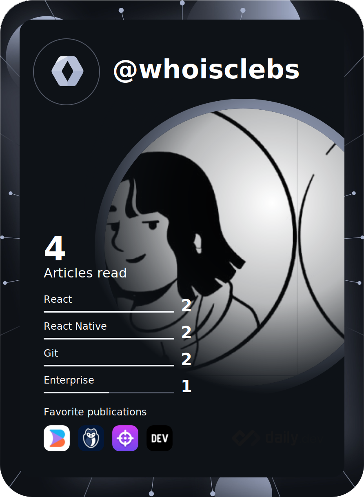

# Hi there 

  
   
   

- `🔭` I'm currently working at <a href="https://www.phoebus.com.br/">@Phoebus</a>
- `🌱` I’m currently learning Clean architecture, web3.0 and microsservices. 
- `💬` Ask me about anything [here](https://github.com/whoisclebs/whoisclebs/discussions).
- `📫` How to reach me: **whoisclebs@proton.me** and **https://whoisclebs.space**
- `📎` Linkedin: **https://www.linkedin.com/in/whoisclebs/**
- `👷` I am a maintainer on two open source communities: 
   - <a href="https://github.com/OctobearHub">Octobear hub</a>
   - <a href="https://github.com/universi-me/">Universi.me</a>

### :octopus: Octo-Ring

I'm a member of [Octo-Ring](https://octo-ring.com/) - a webring (remember those?) for github user profiles. Because why wouldn't I? 

* [previous profile](https://octo-ring.com/p/whoisclebs/prev)
* [random profile](https://octo-ring.com/p/whoisclebs/random)
* [next profile](https://octo-ring.com/p/whoisclebs/next)
